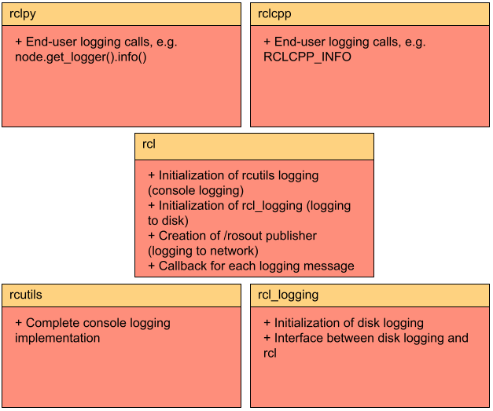

# 会议内容

## ROS2 日志系统介绍

首先，ROS2 的日志系统主要是采用了分布式的设计，摒弃了以往 ROS1 对于 /rosout 的依赖，有了更加灵活的日志管理模式。ROS2 中的日志系统主打的特性在于灵活性，这个灵活性体现在以下几点：

- 多目标日志输出
- 日志级别控制
- 层次化的日志记录器
- 灵活的日志配置
- 丰富的日志 API
- 外部日志服务集成
- 实时日志级别调整

我们接下来的内容都会围绕这几方面展开。

## ROS2 subsystem

在介绍 ROS2 的主要功能时候首先我们需要来了解一下 ROS2 的 subsystem 是什么，因为刚才提及的功能都跟这个系统相关：



首先我们从上往下看，有 rclpy 以及 rclcpp，这两个库的功能是一致的，都是面向开发者用于调用其他底层库的一个接口，而他们的主要区别在于 rclpy 面向的是 python，而 rclcpp 主要面向的是 c++。
同时还有 rclcpp 还有一个特性需要强调的是，它在多线程日志调用的时候会开启全局互斥锁，这样就能保证多线程日志调用线程的安全性，确保了日志输出的可读性。

再往下看是 rcl，rcl 这个库更像是一个指挥中心，比如说我们使用 rclcpp 或者 rclpy 我们定义了我们的日志要从 console 输出并且要保存为文件，这个时候 rcl 会通过 rmw 层去让日志能够从 console 输出，同时调用 rcl_logging 相关库去实现写入磁盘的功能。而 rmw 层是 ros2 中的一个中间件，是用于将日志发布到控制台以及网络的一个库中间件，同时这个中间件主要是负责跟与底层中间件对接。
为什么需要这样的一个中间件是因为有了中间件用户能够根据不同的情况去定制自己的需求，因为现在不是像 ros1 中那样依赖 /rosout，所以可以通过 rmw 层去实现更多的需求，比如说像是是否要从 console 输出，且有一个特性是不同的节点可能会有不同的日志需求，通过 rmw 层去实现日志的输出实际上就是实现不同的节点又不同的日志管理。

所以 rcl 层自身是不实现功能，而是作为一个中心指挥的库。

而 rcutils 是一个能够让日志输出到 /rosout 的一个库，他可以通过被定义不同的日志级别去实现输出不同的级别的日志。而这个库的一个特性是可以实现依赖注入。

最后是 rcl_logging，在保存日志任务当中有 spdlog 以及 interface 两个主要的库。spdlog 这个库负责实现将日志初始化、格式化并且写入到本地磁盘，而 interface 这个库则是用于规范我们 spdlog 库在初始化、格式化日志时候的规范。
那么为什么要这样单独分开两个库，这是为了让开发者能够有更多的开发空间，以应对不同的需求。比如说我目前有一个需求是用户希望日志发送到远程服务器，那么可以通过依赖注入的方式去实现。同时，开发者也可以选择自己开发一个新的库来应对自身的任务环境，这样的库就能跟 interface 配合，保证自身的库是能够符合规范的。也就是说，interface 这个库就相当于是一个“协议”。

## 多目标日志输出

ROS2 中的日志输出能够输出到控制台、磁盘文件以及网络发布（/rosout 主题）。

如果想要实现输出到控制台的效果，可以通过 C++ 代码实现，通过调用 rclcpp 中的 `RCLCPP_INFO ` 宏实现日记记录器去实现日志输出。

而如果要日志写入磁盘文件的话比较简单，直接在环境变量中：

`export ROS_LOG_DIR=/path/to/log`

如果 `ROS_LOG_DIR` 的值为空，那么 ROS2 将会使用 `ROS_HOME` 的环境变量值，并且在这个路径下创建 .log 目录，默认是 `~/.ros/log`

而如果要网络发布的话，直接通过指令：`ros2 topic echo /rosout` 即可。

## 日志级别控制

ROS2 的日志级别与 ROS1 相同，就简单带过了：

- DEBUG
- INFO
- WARN
- ERROR
- FATAL

开发者可以使用在代码中使用不同的宏来实现不同的日志记录，官方提供的宏如下：

```
RCLCPP_{DEBUG,INFO,WARN,ERROR,FATAL}
```

example：

```
RCLCPP_INFO(node->get_logger(), "This is an info message");
```

且 ROS2 还有一大特性就是动态性，能够允许节点在运行的时候动态调整不同的级别的日志输出，主要是通过以下方式实现：

1. 命令行参数设置，在启动节点的时候可以通过 ` --ros-args ` 这个参数去实现，如：`ros2 run package_name node_name --ros-args --log-level DEBUG`

2. 同时，也可以像设置日志写入磁盘文件一样，通过设置环境变量的方式设置：`export RCUTILS_LOGGING_SEVERITY_THRESHOLD=DEBUG`

## 层次化的日志记录器

接着我们说说 ROS2 的另一个特性就是：层次化

这个层次化最直观的体现在命名当中，比如说命名空间 /robot 下面有一个叫做 `sensor` 的节点，那么这个日志记录器的名字就是：/robot.sensor。

而且这个叫做 `sensor`  的节点是会继承来自于 /robot 的日志级别，比如说 /robot 的日志输出级别是 error，那么默认情况下 `sensor` 也是会被设置为 error。

但是如果现在有一个日志记录器为 /robot.sensor.ghi，并且将其设置为 info 级别那么对于就会输出 info 及其以上的级别的日志消息。

## 丰富的日志 API

我们接下来挑几个比较有代表性的 API 来说说 ROS2 日志系统的特性。

1. `RCLCPP_{DEBUG,INFO,WARN,ERROR,FATAL}`

这个 API 在上面说日志级别的时候就已经提及了，简单说一下就是当每次命中该代码的时候就会输出。

示例

2. `RCLCPP_{DEBUG,INFO,WARN,ERROR,FATAL}_EXPRESSION`

这个 API 是指当特定的表达式为真的时候就会出发这个日志消息，这样就能够避免日志消息冗余的情况。
如：

```
RCLCPP_WARN_EXPRESSION(node->get_logger(), sensor_value > threshold, "Sensor value is too high!");
```

3. `RCLCPP_{DEBUG,INFO,WARN,ERROR,FATAL}_THROTTLE`

这个 API 是限制日志输出的功率，通过设置日志消息时间间隔实现，如几毫秒最多输出一次日志，这样就能避免日志泛滥的情况，一般用于监控传感器状态，而不是让他一直持续的输出传感器。

4. `RCLCPP_{DEBUG,INFO,WARN,ERROR,FATAL}_ONCE`

这个 API 也很简单，就是即使多次命中该代码也只输出一次日志。

5. `RCLCPP_{DEBUG,INFO,WARN,ERROR,FATAL}_FUNCTION`

这个 API 是一个判断用的，就是当一个函数返回 `true` 的时候才会输出日志消息

6. `rcutils_logging_set_logger_level`

这个 API 可以让用户动态的调整日志输出的日志级别，用户在需在节点运行的时候通过指令即可调整不同的日志输出级别

7. `rcutils_logging_get_logger_effective_level`

这个 API 可以获取当前日志管理器有效的日志级别，比如说，有一个记录器的结构是：

- x
- x.y
- x.y.z

那么 x 设置了日志级别是 error，而 x.y 和 x.y.z 都没有设置，那么默认继承 x 的日志级别，而这个 API 就会获取到他们的有效日志级别就是 error，如：

```
rcutils_logging_get_logger_effective_level("x.y.z")
// 返回结果为：40
```

要注意的是，这个 API 返回的是数值，不同的日志级别有不同的数值：

- DEBUG：10
- INFO：20
- WARN：30
- ERROR：40
- FATAL：50

## ROS1 与 ROS2 的对比


| **对比项**       | **ROS 1**                                                                                                                                     | **ROS 2**                                                                                                                                                                                                 |
|------------------|-----------------------------------------------------------------------------------------------------------------------------------------------|----------------------------------------------------------------------------------------------------------------------------------------------------------------------------------------------------------|
| **架构设计**     | 依赖中心化的 ROS Master，所有日志消息通过 `/rosout` 主题发布。  | 采用分布式架构，无需中心节点，日志系统更为灵活，支持多种输出方式，包括控制台、文件和 `/rosout` 主题。  |
| **日志级别控制** | 日志级别通常在节点启动时设置，运行期间调整较为不便。                                                                                         | 支持在运行时动态调整日志级别，开发者可以通过参数服务器或服务调用实时修改某个节点的日志级别。  |
| **日志输出方式** | 主要通过 `/rosout` 主题发布日志，依赖于中心节点，输出方式相对单一。  | 支持多种日志输出方式，包括控制台、文件和网络发布，满足不同的调试和监控需求。  |
| **日志 API**     | 提供基本的日志宏，如 `ROS_DEBUG`、`ROS_INFO` 等，功能相对有限。  | 提供更丰富的日志 API，包括限速输出、条件输出等高级功能，增强了日志系统的灵活性和可控性。  |
| **模块化设计**   | 日志系统相对集中，扩展性有限。                                                                                                                 | 采用模块化设计，核心组件如 `rcl_logging_interface` 定义了日志记录的接口规范，具体实现由诸如 `rcl_logging_spdlog` 等模块完成，允许开发者集成外部日志服务以满足特定需求。  |


